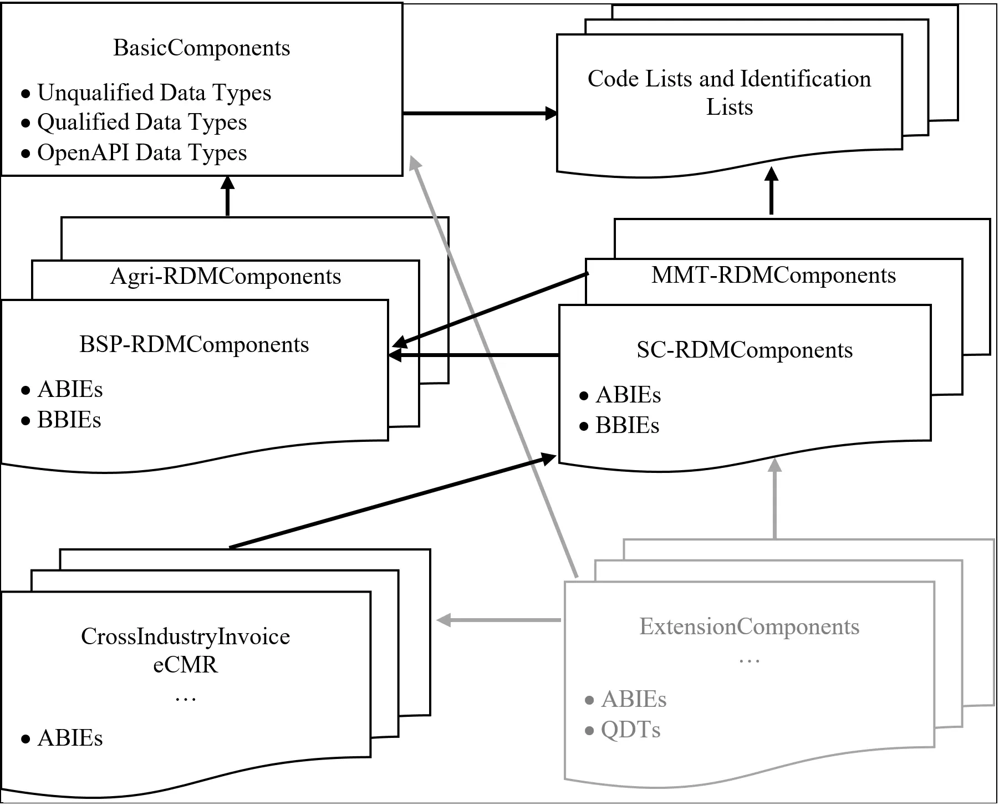

# UN/CEFACT JSON Schema draft 2020-12 meta-library publication

## Introduction

This directory contains JSON schema artefacts. They are fully based on the JSON schema draft 2020-12.
This means that they fully comply with the requirements of OpenAPI 3.1.x.  

The UN/CEFACT reference data models are provided in the library variant, with extended meta-information.  
This means that an individual meta-schema and an additional vocabulary is applied. The additional information
is included to support mapping-processes and the JSON-LD vocabulary creation. 

## Table of contents
<!-- TOC depthFrom:1 depthTo:3 withLinks:1 updateOnSave:1 orderedList:0 -->

- [Basic schema design rules](#basicPrinciples)
- [JSON filenames and sub-folder structure](#jsonFilenames)
- [The meta extension](#metaExtension)

<!-- /TOC -->

## Basic schema design principles

<a name="basicPrinciples" />
Basic rules of the UN/CEFACT Core Component Library can be [found here.](https://unece.org/trade/uncefact/ccts) The version CCTS 2.01 is applied.
In the linked PDF document abbreviations like ABIE, BBIE etc. are explained in detail.

The following figure shows how the different CCTS classes are interlinked and can be extended.

## JSON filenames and sub-folder structure

<a name="jsonFilenames" />

## The meta extension

<a name="metaExtension" />
